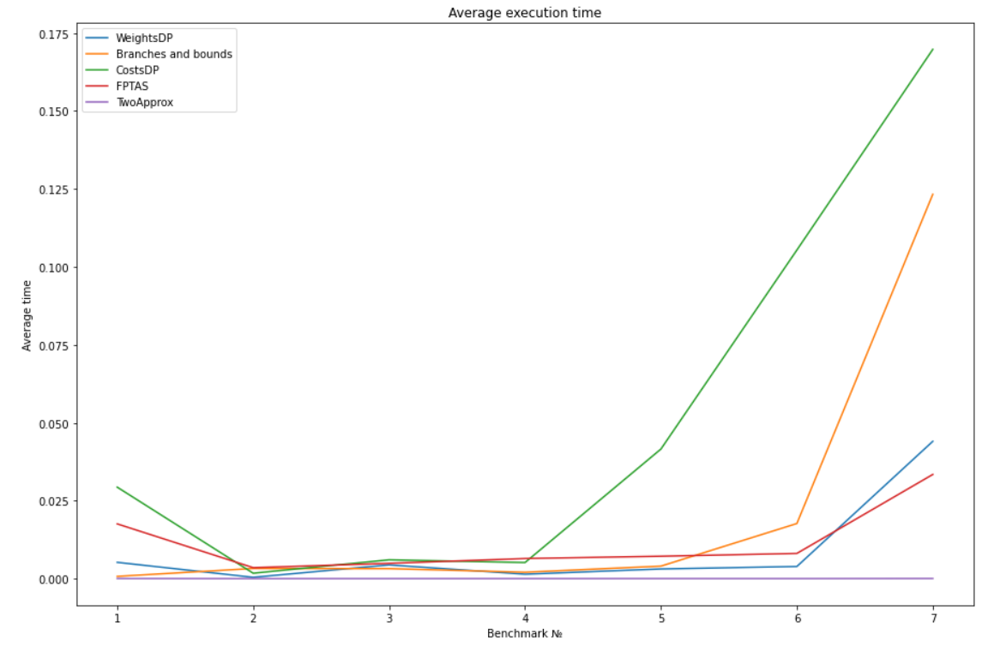

# 0-1 Knapsack Problem

## Results

### benchmark_1

Real result for 1 example: [1, 1, 1, 1, 0, 1, 0, 0, 0, 0]  
Real cost: 309  
Real weight: 165  

|Algorithm        |Average time|Operations number|Optim cost|Optim weight|Items|
|-----------------|------------|-----------------|----------|------------|-----|
|TwoApprox        | 0.000064   | 21              | 309      | 165        | [1, 1, 1, 1, 0, 1, 0, 0, 0, 0] |
|BranchesAndBounds| 0.000756   | 3               | 309      | 165        | [1, 1, 1, 1, 0, 1, 0, 0, 0, 0] |
|WeightsDP        | 0.005253   | 1672            | 309      | 165        | [1, 1, 1, 1, 0, 1, 0, 0, 0, 0] |
|FPTAS            | 0.017584   | 2300            | 309      | 165        | [1, 1, 1, 1, 0, 1, 0, 0, 0, 0] |

### benchmark_2

Real result for 2 example: [0, 1, 1, 1, 0]  
Real cost: 51  
Real weight: 26  

|Algorithm        |Average time|Operations number|Optim cost|Optim weight|Items|
|-----------------|------------|-----------------|----------|------------|-----|
|TwoApprox        | 0.000032   | 11              | 47       | 23         | [1, 0, 1, 0, 0] |
|BranchesAndBounds| 0.003287   | 20              | 51       | 26         | [0, 1, 1, 1, 0] |
|WeightsDP        | 0.000452   | 142             | 51       | 26         | [0, 1, 1, 1, 0] |
|FPTAS            | 0.003550   | 527             | 51       | 26         | [0, 1, 1, 1, 0] |

### benchmark_3

Real result for 3 example: [1, 1, 0, 0, 1, 0]  
Real cost: 150  
Real weight: 190  

|Algorithm        |Average time|Operations number|Optim cost|Optim weight|Items|
|-----------------|------------|-----------------|----------|------------|-----|
|TwoApprox        | 0.000034   | 13              | 146      | 179        | [1, 1, 0, 1, 0, 0] |
|BranchesAndBounds| 0.003229   | 18              | 150      | 190        | [1, 1, 0, 0, 1, 0] |
|WeightsDP        | 0.004433   | 1154            | 150      | 190        | [1, 1, 0, 0, 1, 0] |
|FPTAS            | 0.004929   | 702             | 150      | 190        | [1, 1, 0, 0, 1, 0] |

### benchmark_4

Real result for 4 example: [1, 0, 0, 1, 0, 0, 0]  
Real cost: 107  
Real weight: 50  

|Algorithm        |Average time|Operations number|Optim cost|Optim weight|Items|
|-----------------|------------|-----------------|----------|------------|-----|
|TwoApprox        | 0.000039   | 15              | 107      | 50         | [1, 0, 0, 1, 0, 0, 0] |
|BranchesAndBounds| 0.002089   | 9               | 107      | 50         | [1, 0, 0, 1, 0, 0, 0] |
|WeightsDP        | 0.001450   | 366             | 107      | 50         | [1, 0, 0, 1, 0, 0, 0] |
|FPTAS            | 0.006477   | 914             | 107      | 50         | [1, 0, 0, 1, 0, 0, 0] |

### benchmark_5

Real result for 5 example: [1, 0, 1, 1, 1, 0, 1, 1]  
Real cost: 900  
Real weight: 104  

|Algorithm        |Average time|Operations number|Optim cost|Optim weight|Items|
|-----------------|------------|-----------------|----------|------------|-----|
|TwoApprox        | 0.000046   | 17              | 888      | 92         | [0, 1, 1, 1, 0, 1, 1, 1] |
|BranchesAndBounds| 0.004039   | 21              | 900      | 104        | [1, 0, 1, 1, 1, 0, 1, 1] |
|WeightsDP        | 0.003130   | 850             | 900      | 104        | [1, 0, 1, 1, 1, 0, 1, 1] |
|FPTAS            | 0.007213   | 974             | 890      | 100        | [1, 0, 1, 1, 1, 0, 0, 0] |

### benchmark_6

Real result for 6 example: [0, 1, 0, 1, 0, 0, 1]  
Real cost: 1735  
Real weight: 169  

|Algorithm        |Average time|Operations number|Optim cost|Optim weight|Items|
|-----------------|------------|-----------------|----------|------------|-----|
|TwoApprox        | 0.000038   | 15              | 1735     | 169        | [0, 1, 0, 1, 0, 0, 1] |
|BranchesAndBounds| 0.017701   | 94              | 1735     | 169        | [0, 1, 0, 1, 0, 0, 1] |
|WeightsDP        | 0.003928   | 1206            | 1735     | 169        | [0, 1, 0, 1, 0, 0, 1] |
|FPTAS            | 0.008116   | 1145            | 1735     | 169        | [0, 1, 0, 1, 0, 0, 1] |

### benchmark_7

Real result for 7 example: [1, 0, 1, 0, 1, 0, 1, 1, 1, 0, 0, 0, 0, 1, 1]  
Real cost: 1458  
Real weight: 749  

|Algorithm        |Average time|Operations number|Optim cost|Optim weight|Items|
|-----------------|------------|-----------------|----------|------------|-----|
|TwoApprox        | 0.000074   | 31              | 1441     | 740        | [1, 1, 1, 0, 0, 0, 1, 1, 1, 0, 0, 0, 0, 1, 1] |
|BranchesAndBounds| 0.123281   | 363             | 1458     | 749        | [1, 0, 1, 0, 1, 0, 1, 1, 1, 0, 0, 0, 0, 1, 1] |
|WeightsDP        | 0.044058   | 11282           | 1458     | 749        | [1, 0, 1, 0, 1, 0, 1, 1, 1, 0, 0, 0, 0, 1, 1] |
|FPTAS            | 0.033440   | 4363            | 1450     | 746        | [1, 0, 1, 0, 1, 0, 1, 1, 1, 0, 0, 0, 1, 0, 1] |

### Average time comparison

